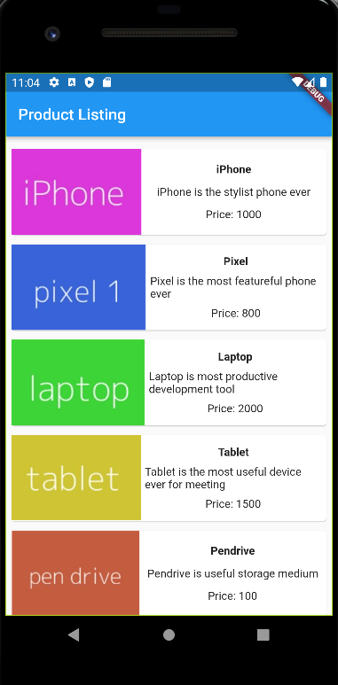

# Int3120_20 Homeworks
- Lesson 1: Tham khảo thông tin cơ bản về Flutter (Giới thiệu, tính năng, điểm mạnh,...)
- Lesson 2: Cài đặt, thiết lập môi trường phát triển
- Lesson 3: Hello World
  - Demo:
  
- Lesson 4: Tìm hiểu về kiến trúc ứng dụng Flutter
- Lesson 5: Tìm hiểu về Dart
- Lesson 6: Widget trong Flutter
  - Demo:
  
- Lesson 7: Layout trong Flutter
  - Demo:
  
- Lesson 8: Gesture trong Flutter
  - Demo:
  
